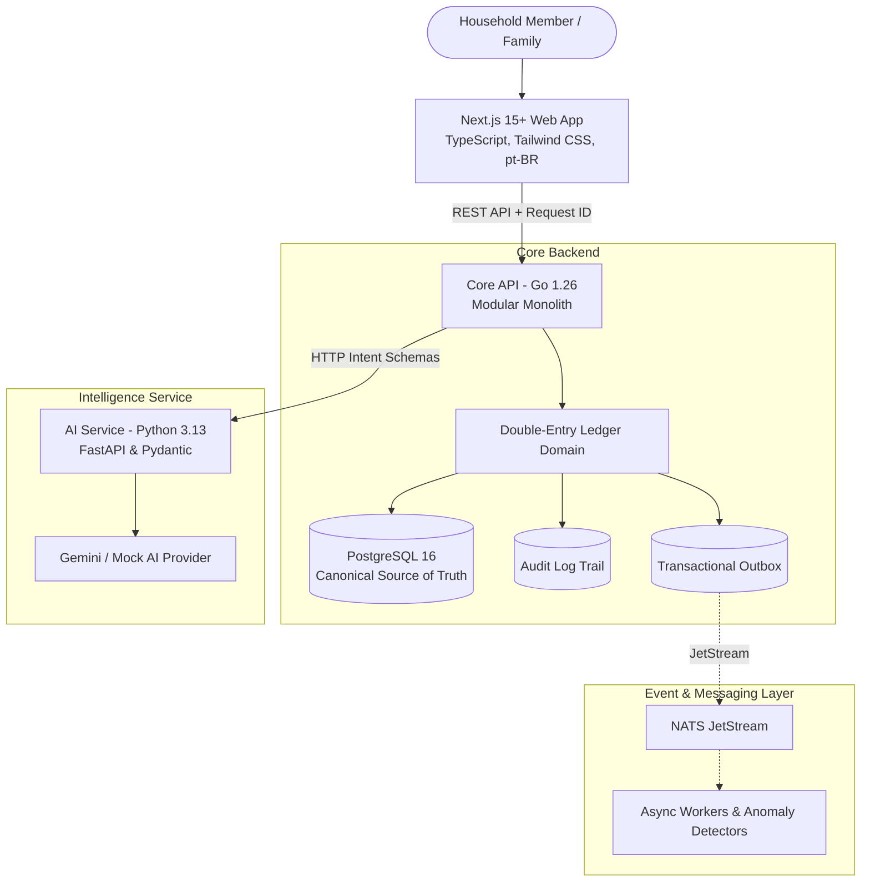

# Finora Gemini Flash Student

> **Autonomous AI-Native Household Financial Intelligence Platform**

Finora Gemini Flash Student transforms fragmented household financial data — spreadsheets, bank exports, credit-card statements, bills, recurring payments, debts, and financial documents — into a unified, mathematically balanced double-entry ledger and intelligent decision system. Designed primarily for Brazilian households transitioning off fragile Excel workbooks, Finora helps families understand not only where their money went, but where it is going.

[](https://github.com/MauricioTAzevedo/finora-gemini-flash-student/actions/workflows/ci.yml)
[](LICENSE)
[](services/api)
[](apps/web)
[](services/ai)
[](database)

---

## Why Finora Exists

Most personal finance apps are either toy CRUD expense trackers or bloated enterprise accounting clones that disregard real household workflows. In Brazil, household finances revolve around specific dynamics: credit card installment purchases (*parcelas*), statement closing vs. due dates, PIX transfers, boleto due dates, and shared family expenses managed inside spreadsheets.

Finora combines:
1. **Mathematical Financial Correctness**: An accounting-grade double-entry ledger that operates strictly on integer minor units (cents). Transfers are not expenses, and credit card payments do not double-count purchases.
2. **First-Class Excel Migration**: A dedicated Import & Migration Center capable of inspecting Brazilian spreadsheet workbooks, inferring columns, parsing dates and currency notations (`R$ 1.250,50`), and detecting duplicates.
3. **AI Interpretation with Deterministic Engine**: AI interprets messy descriptions and maps ambiguous columns; deterministic engines calculate projections, and the immutable ledger records reality.

---

## Architecture Overview



---

## Technical Highlights

- **Integer Minor Units**: All monetary values are represented as `amountMinor` (`BIGINT`) with explicit 3-letter currency codes (`BRL`). No binary floating-point drift.
- **Double-Entry Ledger Equation**: $\sum \text{Debits} = \sum \text{Credits}$ mathematically verified for every posted transaction.
- **Strict Household Multi-Tenancy**: Every database query and command is verified against the authenticated user's role and membership in the household.
- **Deterministic AI Fallback**: Complete offline local development mode (`AI_PROVIDER=mock`) with structured Pydantic schemas. Zero paid API keys required to run tests.
- **Transactional Outbox Pattern**: Database mutations and outbound event publications are atomically committed.
- **GSD Core Development**: Managed and tracked under [GSD Core](https://github.com/open-gsd/gsd-core) with comprehensive phase memory in `.planning/`.

---

## Technology Stack

| Layer | Technologies |
| :--- | :--- |
| **Web UI** | Next.js 15+, React 19, TypeScript, Tailwind CSS, Lucide Icons, Radix UI |
| **Core API** | Go 1.26, Chi router, pgx / standard database interfaces, clean domain models |
| **AI Service** | Python 3.13, FastAPI, Pydantic v2, pytest, Gemini API / Mock Provider |
| **Database** | PostgreSQL 16 (Canonical Storage), raw SQL migrations |
| **Infrastructure** | Docker Compose, Redis 7, NATS JetStream, MinIO S3 Object Storage |
| **CI / DevOps** | GitHub Actions, Git, GSD Core v1.13.0 |

---

## Repository Structure

```text
finora-gemini-flash-student/
├── apps/
│   └── web/                 # Next.js 15+ frontend application
├── services/
│   ├── api/                 # Go 1.26 Core REST API & Ledger Engine
│   └── ai/                  # Python 3.13 FastAPI AI extraction service
├── database/
│   ├── migrations/          # Raw SQL schema migrations
│   └── seeds/               # Synthetic demo seed data ("Família Silva")
├── docs/
│   ├── architecture/        # System diagrams, data model, event schemas
│   ├── adr/                 # Architecture Decision Records (ADR-001+)
│   └── security/            # Threat model and security policies
├── infra/
│   └── docker/              # Container definitions
├── .planning/               # GSD Core project memory, requirements, roadmap
├── .github/workflows/       # GitHub Actions continuous integration
├── docker-compose.yml       # Local infrastructure services
├── Makefile                 # Task runner for Unix / macOS / CI
└── dev.ps1                  # Task runner for Windows PowerShell
```

---

## Quickstart & Local Setup

### 1. Prerequisites
- **Git** 2.40+
- **Go** 1.24+ (tested on Go 1.26)
- **Node.js** 22+ & **pnpm** 10+
- **Python** 3.11+ (tested on Python 3.13)
- **Docker & Docker Compose** (optional for local containers)

### 2. Clone & Environment
```bash
git clone https://github.com/MauricioTAzevedo/finora-gemini-flash-student.git
cd finora-gemini-flash-student
cp .env.example .env
```

### 3. Run Test Suites
```bash
# Windows PowerShell
.\dev.ps1 test

# Unix / Linux / macOS
make test
```

### 4. Run Development Services
```bash
# Start backend API (Port 8080)
cd services/api
go run cmd/server/main.go

# Start web frontend (Port 3000)
cd apps/web
pnpm install
pnpm dev
```

Visit `http://localhost:3000` to view the **Família Silva Demo** dashboard.

---

## Demo Credentials (Synthetic Test Household)

- **User**: `mauricio@example.com`
- **Password**: `demo123456`
- **Household**: `Família Silva Demo`
- **Checking Account**: Nubank Conta (R$ 8.420,00)
- **Credit Card**: Nubank Platinum (Current Bill: R$ 3.120,00)
- **Savings Account**: Reserva de Emergência (R$ 15.800,00)

*Note: All demo data is strictly synthetic and generated for testing and demonstration purposes.*

---

## Architecture Decision Records (ADRs)

- [ADR-001: Modular Monolith as Initial Architecture](docs/adr/ADR-001-modular-monolith.md)
- [ADR-002: PostgreSQL as Source of Truth](docs/adr/ADR-002-postgresql-source-of-truth.md)
- [ADR-003: Integer Minor Units for Money](docs/adr/ADR-003-integer-minor-units-for-money.md)
- [ADR-004: Double-Entry Ledger Engine](docs/adr/ADR-004-double-entry-ledger.md)
- [ADR-005: AI Provider Abstraction and Deterministic Fallback](docs/adr/ADR-005-ai-provider-abstraction.md)

---

## License

Finora Gemini Flash Student is open-source software licensed under the [MIT License](LICENSE).
