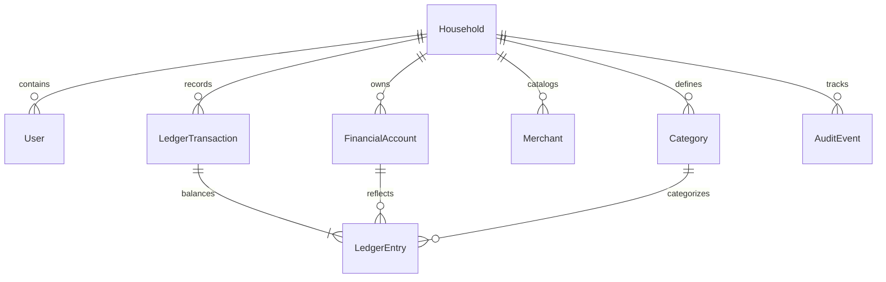

# Data Model — Finora Gemini Flash Student

Finora uses a double-entry ledger domain model where every transaction maintains an immutable journal entry trail.

## Entity Relationship Diagram

## Core Schema Definitions

### 1. `households`
- `id` (UUID PK): Unique household identifier.
- `name` (VARCHAR): e.g. "Família Silva".
- `currency` (VARCHAR(3)): Default `'BRL'`.
- `locale` (VARCHAR(10)): Default `'pt-BR'`.
- `created_at` (TIMESTAMPTZ).

### 2. `financial_accounts`
- `id` (UUID PK).
- `household_id` (UUID FK).
- `name` (VARCHAR): e.g. "Nubank Conta", "Itaú CC".
- `type` (VARCHAR): `'checking'`, `'savings'`, `'credit_card'`, `'cash'`, `'investment'`.
- `currency` (VARCHAR(3)): `'BRL'`.
- `initial_balance_minor` (BIGINT): Starting balance in integer cents.
- `current_balance_minor` (BIGINT): Current computed balance.

### 3. `ledger_transactions`
- `id` (UUID PK).
- `household_id` (UUID FK).
- `occurred_at` (TIMESTAMPTZ): Date and time of the financial event.
- `description` (VARCHAR): Clean description.
- `status` (VARCHAR): `'draft'`, `'posted'`, `'reversed'`.
- `source` (VARCHAR): `'manual'`, `'import_xlsx'`, `'import_ofx'`, `'import_csv'`.
- `reference_id` (VARCHAR): Optional external reference.

### 4. `ledger_entries`
- `id` (UUID PK).
- `transaction_id` (UUID FK).
- `account_id` (UUID FK).
- `entry_type` (VARCHAR): `'debit'` or `'credit'`.
- `amount_minor` (BIGINT): Always positive integer cents.
- `category_id` (UUID FK, nullable): Category associated with expense/income postings.

### Invariant:
For every `transaction_id`, the double-entry balance check holds:
$$\sum_{\text{entry\_type} = \text{'debit'}} \text{amount\_minor} = \sum_{\text{entry\_type} = \text{'credit'}} \text{amount\_minor}$$
