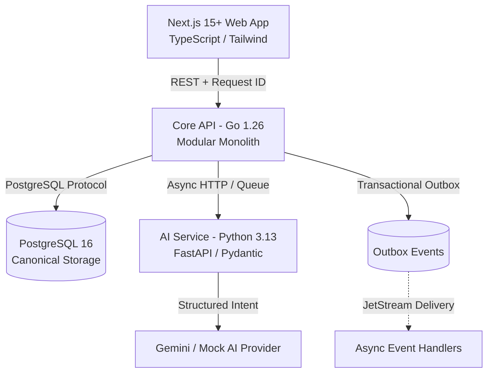

# System Overview — Finora Gemini Flash Student

Finora Gemini Flash Student is an autonomous AI-native household financial intelligence platform designed to replace spreadsheet-based family workflows with a double-entry ledger, intelligent document/statement ingestion, deterministic forecasting, and decision support.

## Core Architectural Layers

### 1. Web Application (`apps/web`)
- Built with Next.js 15+ (App Router), React 19, TypeScript, and Tailwind CSS.
- First-class pt-BR localization, Brazilian Real (`BRL`) formatting conventions, and dense table views optimized for users accustomed to Excel.

### 2. Core Backend API (`services/api`)
- Written in Go 1.26 for predictable execution, high concurrency, and zero runtime bloat.
- Enforces strict financial accounting rules:
  - **Integer minor units** (`amountMinor` in cents) to prevent floating-point drift.
  - **Double-entry equation** ($\sum \text{Debits} = \sum \text{Credits}$).
  - **Multi-tenant Household Isolation** checked at every boundary.
  - **Transactional Outbox** pattern ensuring database state and published events are atomic.

### 3. AI & Data Intelligence Service (`services/ai`)
- Implemented in Python 3.13 with FastAPI and Pydantic structured schemas.
- Handles document extraction, Brazilian spreadsheet column mapping, merchant normalization, and semantic classification.
- Backed by an abstract provider interface with a deterministic `MockAIProvider` for fully offline testing.

### 4. Canonical Storage (`database/`)
- PostgreSQL 16 is the sole source of transactional truth.
- Raw SQL migrations guarantee transparent, reproducible database evolution without opaque ORM abstractions.
